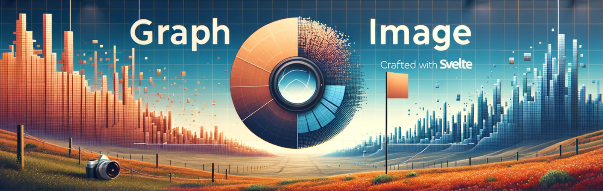

Advanced Lazy-Loading and Compression with Svelte/SvelteKit and Hygraph

[](https://npmjs.org/package/graph-image)
[](https://npmjs.org/package/graph-image)
[](https://github.com/ObieMunoz/graph-image/actions/workflows/release.yml)
[](https://www.github.com/obiemunoz/graph-image)
[](https://graph-image.obiemunoz.com)
[](https://npmjs.org/package/graph-image)
[](https://npmjs.org/package/graph-image)

[Demo](https://graph-image.obiemunoz.com) • [Obie Munoz](https://www.obiemunoz.com/)

# Graph Image Turborepo
## DEPRECATED - Graph Image is no longer being updated/maintained as of 5/22/25.

This Turborepo includes the [graph-image](https://github.com/ObieMunoz/graph-image/blob/main/graph-image/README.md) npmjs package and the [demo](https://github.com/ObieMunoz/graph-image/blob/main/demo/README.md) application.

## Build

To build both the package and the demo application, run the following command:
```bash
pnpm build
```

## Running the Demo

To develop and run the demo app, run the following command:

```bash
pnpm dev
```
## Contributing

We welcome contributions from everyone. If you see an issue you would like to address, please comment on the issue and create a pull request.

### Bug Reports and Feature Requests

Please use the [issue tracker](https://github.com/ObieMunoz/graph-image/issues) provided by GitHub to send us bug reports or feature requests. 

### Pull Requests

1. Fork the repository and create your branch from `main`.
2. If you've added code that should be tested, add unit tests.
3. If you've changed APIs, update the documentation.
4. Ensure the test suite passes.
5. Make sure your code has been formatted using `prettier`

## License

This project is licensed under the [MIT License](https://github.com/ObieMunoz/graph-image/blob/main/graph-image/LICENSE.md).

## Contact

If you have any questions, feel free to reach out to us at [graphimage@obiemunoz.com](mailto:graphimage@obiemunoz.com).

## Acknowledgements

Thanks to all contributors who have helped to improve this project.
